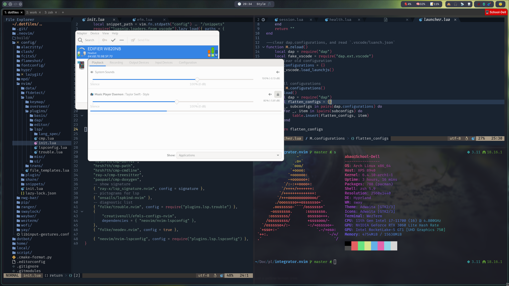

# dotfiles

My dotfiles for Neovim, zsh,...  optimized for ArchLinux and WSL. Managed with [Dotter](https://github.com/SuperCuber/dotter).



## QuickStart

**ArchLinux**

```bash
git clone https://github.com/AbaoFromCUG/dotfiles ~/.dotfiles
yay -S dotter
cp .dotter/local.template.toml .dotter/local.toml
dotter
```

## Desktop Environment

* [Hyprland](https://hyprland.org/) a dynamic tiling Wayland compositor

* System bar via [quickshell](https://github.com/outfoxxed/quickshell), consist of systray, time and control componnets

* [Wofi](https://hg.sr.ht/~scoopta/wofi), a launcher for wayland

* [Pipewire](https://wiki.archlinux.org/title/PipeWire) for multimedia framework, support pulseaudio/JACK/ALSA-based applications

* Fcitx5, a input method framework

## Terminal

* I use [Kitty](https://sw.kovidgoyal.net/kitty/), but [Tmux](https://github.com/tmux/tmux) as multiplexer

* [Zsh](https://www.zsh.org/) + [powerlevel10k](https://github.com/romkatv/powerlevel10k) as my shell

* Neovim on its [lastet release](https://github.com/neovim/neovim/commits/master)
